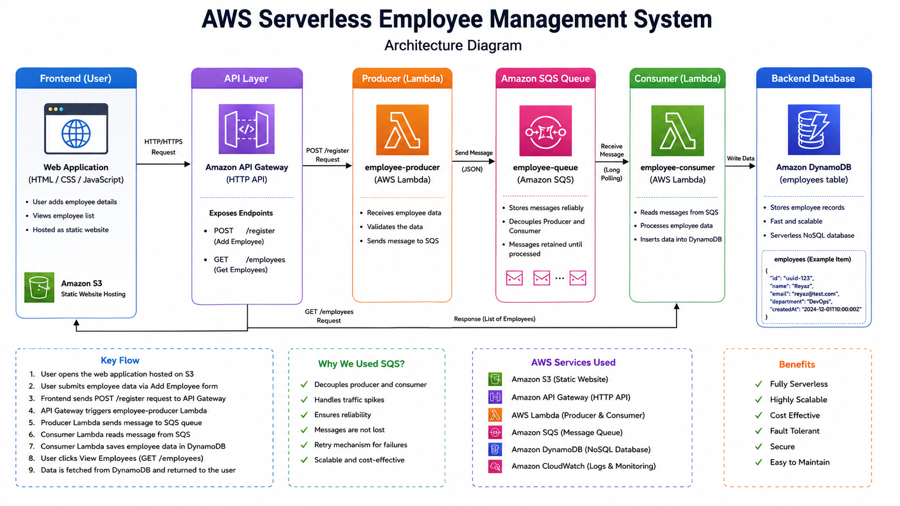

# AWS Serverless Event-Driven Employee Management System

An enterprise-grade, serverless employee management web application built on AWS using an **Event-Driven Architecture** with **Amazon S3, API Gateway, AWS Lambda, Amazon SQS, and DynamoDB**.

---

## 🛑 Live Demo

The application was successfully deployed and tested on AWS.
**Note:** The live deployment is currently unavailable because the infrastructure was built using the AWS Free Tier and has been torn down to avoid ongoing cloud charges. Architecture diagrams, implementation details, and codebase are fully documented below.

---

## 📐 Architecture Diagram

---

## 🎯 High-Level Overview

This project demonstrates an asynchronous, decoupled architecture designed to handle high write-loads efficiently:

1. **Frontend**: Static web interface hosted on **Amazon S3**.
2. **API Layer**: **Amazon API Gateway (HTTP API)** exposes REST endpoints and routes HTTP requests with CORS support.
3. **Producer Lambda**: Receives request payloads and immediately buffers them into **Amazon SQS**.
4. **Decoupling Layer**: **Amazon SQS** decouples API ingestion from database writes to handle traffic spikes smoothly.
5. **Consumer Lambda**: Triggered automatically by SQS to batch-process records into the database.
6. **Database**: **Amazon DynamoDB** stores employee records reliably as a fast NoSQL database.

---

## 💡 Key Architectural Benefits (Why SQS?)

* **Decoupling**: Producer Lambda responds immediately without waiting for database writes.
* **Fault Tolerance**: If DynamoDB or downstream logic fails, messages stay safe inside SQS.
* **Scalability**: SQS absorbs traffic spikes seamlessly, preventing backend throttling.

---

## 🛠️ AWS Services & Tech Stack

* **Frontend**: HTML5, JavaScript (Fetch API)
* **Compute**: AWS Lambda (Python 3.14 / Boto3 SDK)
* **API Ingestion**: Amazon API Gateway (`/register`, `/employees`)
* **Queue**: Amazon SQS (Standard Queue)
* **Database**: Amazon DynamoDB
* **Hosting**: Amazon S3 Static Website Hosting

---

## 🚀 Setup & Execution Flow

### 1. Database & Queue Setup
* Created a DynamoDB table named `employees` with Partition Key `id` (String).
* Configured an Amazon SQS Standard Queue named `employee-queue`.

### 2. Backend Implementation (AWS Lambda)
* **`employee-producer`**: Receives data via POST API and sends message payload to `employee-queue`.
* **`employee-consumer`**: Subscribes to `employee-queue` and batch-writes items into DynamoDB.
* **`get-employees`**: Scans DynamoDB `employees` table to return all records.

### 3. API & Web Hosting
* Created HTTP API Gateway with CORS enabled (`*`).
* Mapped routes:
  * `POST /register` ➔ `employee-producer`
  * `GET /employees` ➔ `get-employees`
* Deployed static frontend UI to Amazon S3 Bucket with public web hosting enabled.

---

## 🧪 Testing Asynchronous Behavior

1. Temporarily disable the SQS trigger on `employee-consumer`.
2. Add new employees via the S3-hosted web application.
3. Observe messages queuing up inside **Amazon SQS**.
4. Re-enable the trigger to watch SQS automatically drain and populate items into **DynamoDB**.

---

## 🛠️ Skills Demonstrated

* Amazon S3 (Static Web Hosting)
* Amazon API Gateway (HTTP API & CORS)
* AWS Lambda (Serverless Compute & Boto3)
* Amazon SQS (Message Buffering & Decoupling)
* Amazon DynamoDB (NoSQL Data Modeling)
* Amazon CloudFront & Route 53
* AWS IAM (Least Privilege Roles & Policies)
* Amazon CloudWatch (Logging & Monitoring)
* Event-Driven Architecture
* Serverless Web Application Design

---

## 🤝 Connect with Me

**Chhatrapal Janghel**  
*AWS Cloud | DevOps | Multi-Cloud*

* **LinkedIn**: https://www.linkedin.com/in/chhatrapaljanghel7
* **Portfolio**: https://chhatrapal.in
